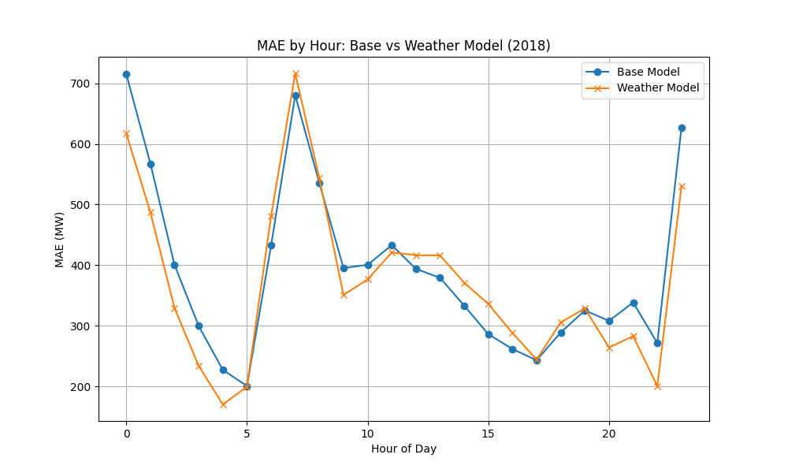

# Relatório de Modelagem com Variáveis Climáticas

## Objetivo
Avaliar o impacto da inclusão de variáveis meteorológicas (temperatura, vento, irradiância) na precisão do modelo de previsão de carga horária para a zona AEP.

## Metodologia
- **Período de Treino**: 2016-2017
- **Período de Teste**: 2018
- **Variáveis Climáticas**: Dados obtidos via Open-Meteo (reanalysis/archive) para a coordenada representativa de Columbus, OH (39.9612, -82.9988).
  - `temp_c`: Temperatura a 2m (°C)
  - `wind_ms`: Velocidade do vento a 10m (m/s)
  - `irradiance_wm2`: Radiação de onda curta (W/m²)

### Modelos Comparados
1. **Base Model (v2)**: 
   - Features: Hora, Dia da Semana, Mês, Lags (1h, 24h), Feriado (Federal US), Fim de Semana.
2. **Weather Model**:
   - Features: Base Model + `temp_c`, `wind_ms`, `irradiance_wm2`.

## Resultados (Ano 2018)

| Modelo | MAE (MW) | RMSE (MW) |
|---|---:|---:|
| Base Model | 389.41 | 489.95 |
| Weather Model | 371.28 | 466.66 |
| **Melhoria** | **-18.12** | **-23.29** |

A inclusão das variáveis climáticas reduziu o erro absoluto médio em cerca de 4.6% em relação ao modelo base já otimizado.

## Análise Gráfica
A figura abaixo mostra a distribuição do erro médio absoluto (MAE) por hora do dia para os dois modelos.

Observa-se que o modelo com clima tende a performar melhor, especialmente nos horários diurnos onde a temperatura e irradiância têm maior correlação com a carga (ar condicionado, iluminação).

## Conclusão e Próximos Passos
- A integração de dados climáticos trouxe ganho consistente de performance.
- Recomenda-se operacionalizar a coleta diária de previsão de tempo para alimentar o modelo em produção.
- Próximos testes podem explorar features não-lineares de temperatura (ex: CDD/HDD - Cooling/Heating Degree Days) para capturar melhor a resposta térmica da carga.
